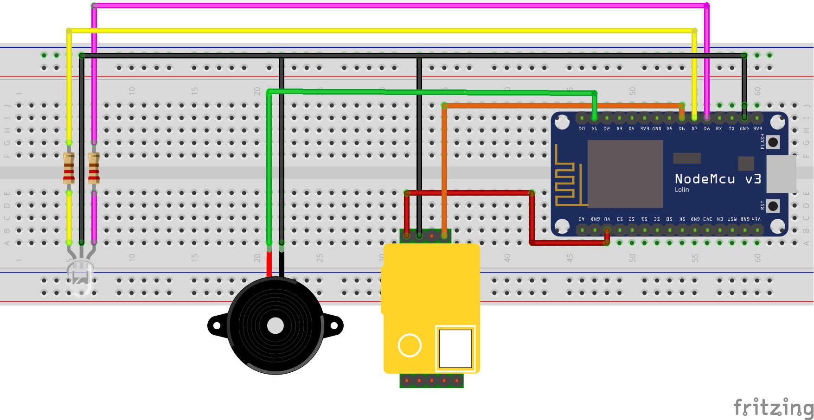

# CO2 Measurement Device
An ESP 8266 microcontroller with a CO2 sensor measure the indoor air quality and remind to ventilate the room. <a href="https://www.hackster.io/367592/co2-measuring-device-for-determining-air-quality-covid-19-1910ee">Full project description available on hackster.io</a> 
# Caution:
<b>This device provides support for indoor ventilation. It measures co2. It cannot detect coronavirus. A corona infection cannot be prevented with this device!</b>
# Idea:
The idea was to develop an indicator for the risk of infection with the coronavirus through aerosols. To determine the amount of aerosol in the air we decided to detect the amount of co2 in the air.
When breathing out CO2 is emitted. Over a longer period of time with several people in one room, the amount of CO2 in the room therefore increases.

If there is an infectious person in the room, the amount of aerosols containing the coronavirus will also increase.
The measured co2 value should be easily communicated to everyone and a simple reminder to ventilate the room should be provided to improve the air quality.
# Components:
<ul>
  <li>1x ESP8266 Node-MCU V3</li>
  <li>1x ESP8266 Node-MCU V3</li>
  <li>1x LED red yellow</li>
  <li>2x resistor for the LED (ex. 68 ohm)</li>
  <li>1x MH-Z19B CO2-Sensor</li>
  <li>1x Piezo Buzzer Alarm Sensor</li>
</ul>

# Schematics:

# Implementation:
For the easy access we decides to build an IoT-device with an ESP8266. The measured values can be accessed by the everyone with his own smartphone. As reminder to ventilate the room, we use a piezo buzzer alarm sensor, which makes a beep sound when a certain co2-level is reached. An LED also indicates the Co2 levels.

The measured values can be accessed over a standalone WiFi from the ESP8266, called "CO2Measurement-XXXX" or over your local home-WiFi. Your home-WiFi can be typed in over the webpage of the ESP8266, when it is in standalone WiFi-mode. In standalone WiFi-mode the ESP8266 can be accessed over the ip-address: 10.10.10.1

In home-WiFi-mode the ESP8266 can be accesses over the local ip-address assigned by your home-router.

It is also possible to use the co2-sensor in your smarthome. For that the values are provided as xml-file.

# Releases:
<a id="downloadVersion3.2" href="https://github.com/fgoe12/co2MeasurementDevice/archive/v3.2.zip">Download release version 3.2</a>

# How to:
<ol>
  <li>Download and install <a href="https://www.arduino.cc/en/Main/software">Arduino IDE.</a></li>
  <li>Download latest release version of co2MeasurementDevice.</li>
  <li>Open .ino file of downloaded co2MeasurementDevice version in Arduino IDE.</li>
  <li>Flash .ino file to your ESP8266.</li>
  <li>Upload files in data directory with the ESP8266 Sketch Data Upload button.</li>
</ol>

